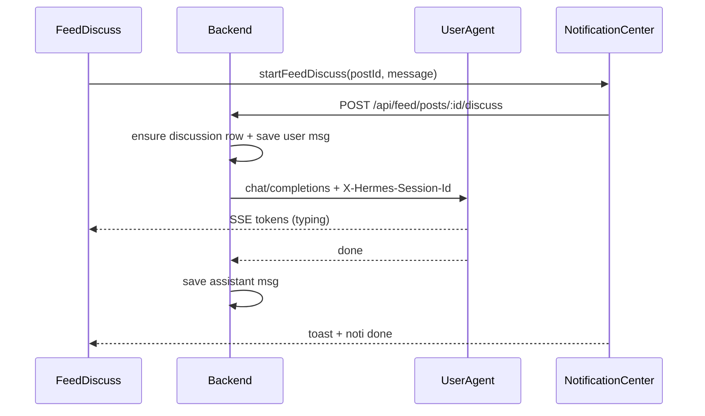

# Feed Discuss (Facebook-style)

## Approach

Inline on the feed card (not a modal). Each feed post gets **one** Hermes session (`feed-discuss-u{userId}-p{postId}`), created on first message via `X-Hermes-Session-Id` on `/v1/chat/completions`. Messages are also stored in Musely SQLite so the thread survives reload. Sending a comment starts a `feed_discuss` notification job (same pattern as writing queue): panel shows typing; when the stream finishes, toast + noti center update.

## Backend

**Schema** in [`apps/backend/db/schema.sql`](apps/backend/db/schema.sql) + ensure in [`apps/backend/db.js`](apps/backend/db.js):

- `feed_discussions(id, user_id, post_id, hermes_session_id, created_at, updated_at)` — unique `(user_id, post_id)`
- `feed_discussion_messages(id, discussion_id, role, content, created_at)` — `user` | `assistant`

**Hermes proxy** — extend [`apps/backend/musely-agent-chat.js`](apps/backend/musely-agent-chat.js) / [`musely-agent-request.js`](apps/backend/musely-agent-request.js):

- Accept `sessionId` and forward `X-Hermes-Session-Id` on upstream `/v1/chat/completions`
- First turn for a new discussion: user message includes full post context (title, topic, what’s new, why it matters, sources) + the user’s comment; later turns send only the new user line (Hermes loads history via session header)

**Routes** in [`apps/backend/index.js`](apps/backend/index.js):

- `GET /api/feed/posts/:id/discuss` — thread `{ discussion, messages }`
- `POST /api/feed/posts/:id/discuss` — body `{ message }`; SSE stream of assistant reply (reuse `handleMuselyAgentStreamRequest` with session id); persist user msg before stream and assistant msg after (buffer streamed text server-side or have client POST back — **chosen:** buffer on server while proxying SSE, then insert assistant row when stream ends)

## Frontend

**API** in [`apps/frontend/src/api.ts`](apps/frontend/src/api.ts): `getFeedDiscuss`, `sendFeedDiscuss` (stream via `streamMuselyAgentRequest`).

**Notifications** — extend [`apps/frontend/src/notifications/types.ts`](apps/frontend/src/notifications/types.ts) + [`NotificationContext.tsx`](apps/frontend/src/notifications/NotificationContext.tsx):

- Kind `feed_discuss` with `postId`, `postTitle`
- `startFeedDiscuss({ postId, postTitle, message })` — running → activity/typing breadcrumbs → done/error toast (“Your agent replied about …”)
- `discussRevision` so open panels refresh messages when job completes
- Wire dismiss/cancel/select in [`NotificationCenter.tsx`](apps/frontend/src/components/NotificationCenter.tsx); click opens Feed and focuses that post’s discuss panel

**UI** — replace placeholder in [`FeedCard.tsx`](apps/frontend/src/components/FeedCard.tsx) with `FeedDiscussPanel`:

- Load history when Discuss opens
- Comment list (user / agent), composer at bottom
- On send: optimistic user bubble + “Musely agent is typing…” dots
- Stream updates live bubble; on complete, panel already has the reply; noti fires from context
- Styles next to existing `.feed-card-discuss` in [`styles.css`](apps/frontend/src/styles.css) (compact Facebook-like thread, no new card chrome)

## Defaults (locked in)

- One Hermes session per user+post (reuse on follow-ups; new id only on first discuss)
- Background-capable via notification job (can leave Feed; toast still fires)
- No new Hermes skill file — free-form discuss with post context in the prompt
- Persist in Musely DB (don’t rely on Hermes-only history for UI)
