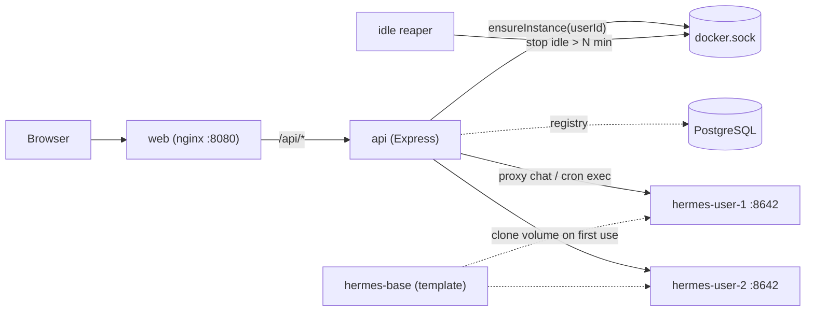

# writer-app — Docker & VPS Setup

One `docker-compose.yml` runs **PostgreSQL**, the **API**, and the **web UI**. Each
signed-in user gets their own **isolated Hermes container** (`hermes-user-<id>`),
provisioned on demand by the API orchestrator and stopped after idle.

| Service | URL | Role |
|---|---|---|
| **web** | http://localhost:8080 | React UI (nginx) |
| **api** | internal :8081 | Express API + Google auth + Hermes orchestrator |
| **postgres** | internal :5432 | PostgreSQL database |
| **hermes-user-&lt;id&gt;** | internal :8642 | Per-user Hermes gateway (created at runtime) |
| **hermes-base-setup** | — | One-time template builder (setup profile only) |

The API, all per-user Hermes containers, and Postgres share **PostgreSQL** via
`DATABASE_URL`. Per-user instances are seeded from a shared, pre-configured base
template (`./hermes-base`) so they inherit the same LLM credentials.

---

## How the orchestrator works



- On chat/cron, the API calls `ensureInstance(userId)`: provisions a volume +
  container if missing, starts it if stopped, waits for `/health`, then routes.
- A background reaper stops instances idle beyond `HERMES_IDLE_MINUTES`.
- First use after idle returns HTTP `202` and the UI shows "Starting your Hermes
  instance…" then retries (cold start ~10-30s).

Trade-off: because idle instances are stopped, **scheduled cron jobs only run
while that user's instance is active**. Creating or running a job starts it.

---

## Google OAuth setup

1. Open [Google Cloud Console](https://console.cloud.google.com/) → **APIs & Services** → **Credentials**.
2. Create **OAuth 2.0 Client ID** (Web application).
3. **Authorized redirect URI** (must match `.env` exactly):
   - Local Docker: `http://localhost:8080/api/auth/google/callback`
   - VPS: `http://YOUR_VPS_IP:8080/api/auth/google/callback` (or your domain)
4. Copy **Client ID** and **Client secret** into `.env`.
5. Set `SESSION_SECRET` (`openssl rand -hex 32`).

For **local dev** (Vite on :5173, API on :8081), use redirect URI
`http://localhost:8081/api/auth/google/callback` and `CLIENT_URL=http://localhost:5173`.

---

## First-time setup

```bash
cd writer-app

cp .env.docker.example .env
# Edit .env: SESSION_SECRET, GOOGLE_CLIENT_ID, GOOGLE_CLIENT_SECRET, HERMES_API_SERVER_KEY

# 1. Build the shared Hermes base template (one-time LLM setup wizard).
#    Persisted to ./hermes-base and cloned into each user's volume.
mkdir -p hermes-base
docker compose run --rm hermes-base-setup setup

#    (Reusing an existing configured ./hermes-data instead? Copy it:)
#    cp -a hermes-data/. hermes-base/

# 2. Start the stack. Per-user Hermes containers are created on demand.
docker compose up -d --build
```

Open **http://localhost:8080** → **Continue with Google** → sidebar **Scheduled tasks** for cron jobs.

Verify:

```bash
curl -s http://localhost:8080/api/health
docker ps --filter name=hermes-user-   # per-user instances appear once users are active
```

---

## Local dev (without Docker for UI/API)

```bash
docker compose up -d postgres

cp .env.example .env
# Fill GOOGLE_* and SESSION_SECRET

npm run install:all
npm run dev
```

- Frontend: http://localhost:5173
- API: http://localhost:8081 (Vite proxies `/api` to the API)

Without the Docker socket the orchestrator is disabled and the API falls back to a
single shared Hermes (`HERMES_API_BASE_URL` / `HERMES_API_SERVER_KEY`).

---

## VPS deploy

```bash
rsync -avz --exclude node_modules --exclude hermes-base \
  ~/Documents/writer-app/ user@YOUR_VPS_IP:~/writer-app/

ssh user@YOUR_VPS_IP
cd ~/writer-app
cp .env.docker.example .env
nano .env   # SESSION_SECRET, Google OAuth, strong HERMES_API_SERVER_KEY

mkdir -p hermes-base
docker compose run --rm hermes-base-setup setup
docker compose up -d --build
```

Set `GOOGLE_CALLBACK_URL` and `CLIENT_URL` to your public URL (e.g. `http://YOUR_VPS_IP:8080`).

### RAM budgeting (important)

Each **active** user runs a full Hermes container (`HERMES_USER_MEMORY`, default
`4g`). On a single VPS, concurrent active users are limited by RAM:

```
max concurrent users ≈ (host RAM - ~2GB for OS/postgres/api/web) / HERMES_USER_MEMORY
```

Tune `HERMES_IDLE_MINUTES` (shorter = fewer running instances) and
`HERMES_USER_MEMORY` / `HERMES_USER_CPUS` to fit your host.

---

## Environment variables

| Variable | Default | Purpose |
|---|---|---|
| `WRITER_PORT` | `8080` | Host port for web UI |
| `CLIENT_URL` | `http://localhost:8080` | CORS + OAuth redirect after login |
| `SESSION_SECRET` | — | Signs session cookie (required) |
| `GOOGLE_CLIENT_ID` / `SECRET` | — | Google OAuth |
| `GOOGLE_CALLBACK_URL` | `http://localhost:8080/api/auth/google/callback` | Must match Google Console |
| `POSTGRES_*` | `writer` / `writer` / `writer` | Database credentials |
| `HERMES_API_SERVER_KEY` | — | Base-template API key (≥16 chars) |
| `HERMES_IMAGE` | `nousresearch/hermes-agent:latest` | Image for per-user instances |
| `HERMES_IDLE_MINUTES` | `15` | Stop a user's instance after this idle time |
| `HERMES_USER_MEMORY` | `4g` | RAM cap per user instance |
| `HERMES_USER_CPUS` | `2.0` | CPU cap per user instance |
| `HERMES_ORCHESTRATOR` | — | Set `disabled` to use a single shared Hermes |
| `AGENT_API_KEY` | — | Hermes HTTP agent routes (`X-Agent-Key`) |
| `OPENROUTER_API_KEY` | — | Task chat on highlighted passages |

---

## Troubleshooting

**Google sign-in fails** — redirect URI in Google Console must match `GOOGLE_CALLBACK_URL` exactly (including port).

**401 on API after login** — check `SESSION_SECRET` is set and stable across restarts; cookies require same-site fetch (`credentials: 'include'`).

**Chat stuck on "Starting your Hermes instance…"** — inspect the user's container:

```bash
docker ps -a --filter name=hermes-user-
docker logs hermes-user-<id>
```

Common causes: base template not built (`./hermes-base` empty — run the setup
wizard), or the `writer-net` network name mismatch (compose pins it to `writer-net`).

**Per-user container can't reach Postgres** — it must be on `writer-net` (the
orchestrator attaches it automatically) and resolve the `postgres` alias.

**Instance never stops** — check the reaper log line on API start and
`HERMES_IDLE_MINUTES`; the reaper only stops `status='running'` rows.

**Logs**

```bash
docker compose logs -f api      # orchestrator + routing
docker compose logs -f web
docker logs hermes-user-<id>    # a specific user's Hermes
```

**Agent CLI inside a user's Hermes**

```bash
docker exec -w /app hermes-user-<id> node --no-warnings=ExperimentalWarning server/agent-cli.js active
```

**Scheduled tasks (cron UI)** — the **Scheduled tasks** page wraps `hermes cron`
via `docker exec hermes-user-<id> hermes cron …`. Listing reads the user's volume
directly (works while idle); creating/running a job starts the instance. Requires
the API container's docker socket mount (already in `docker-compose.yml`).
